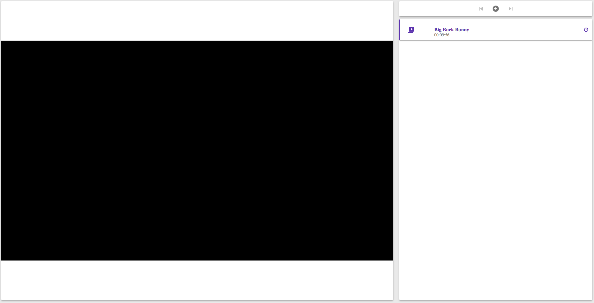
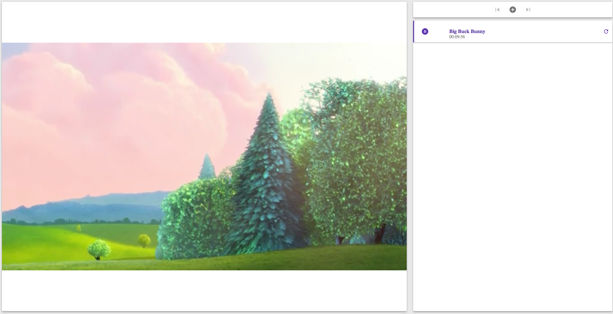
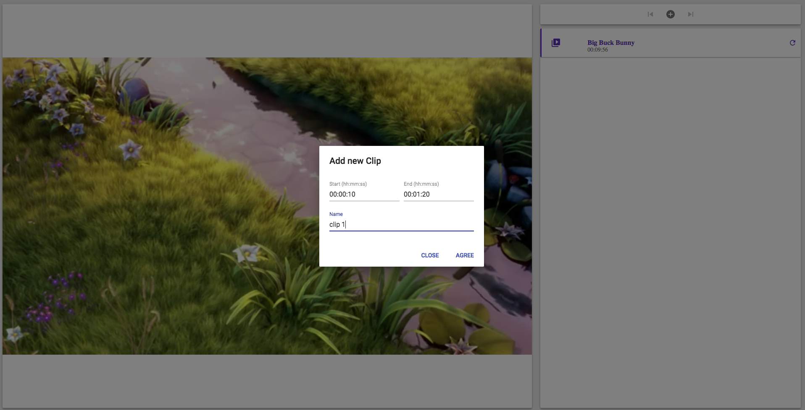
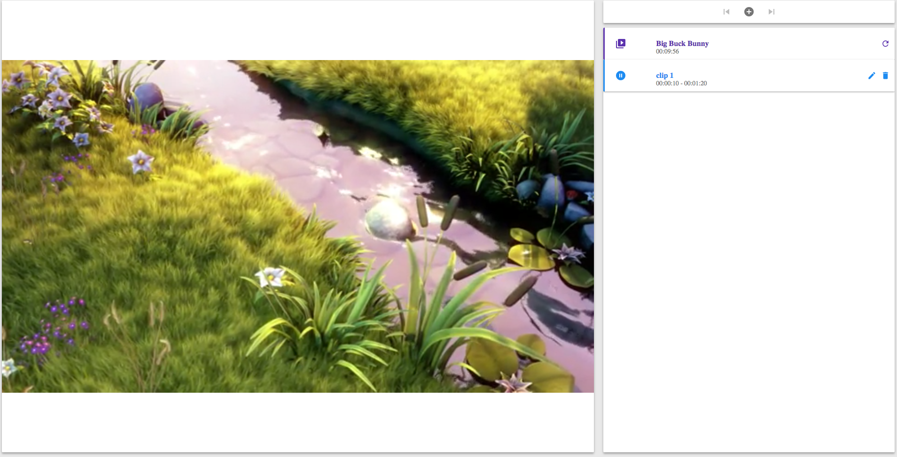
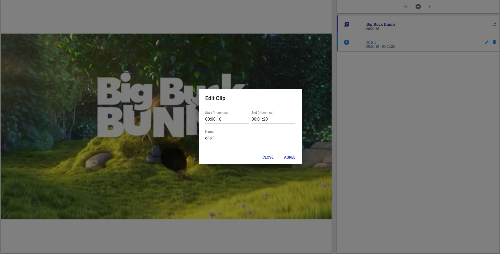
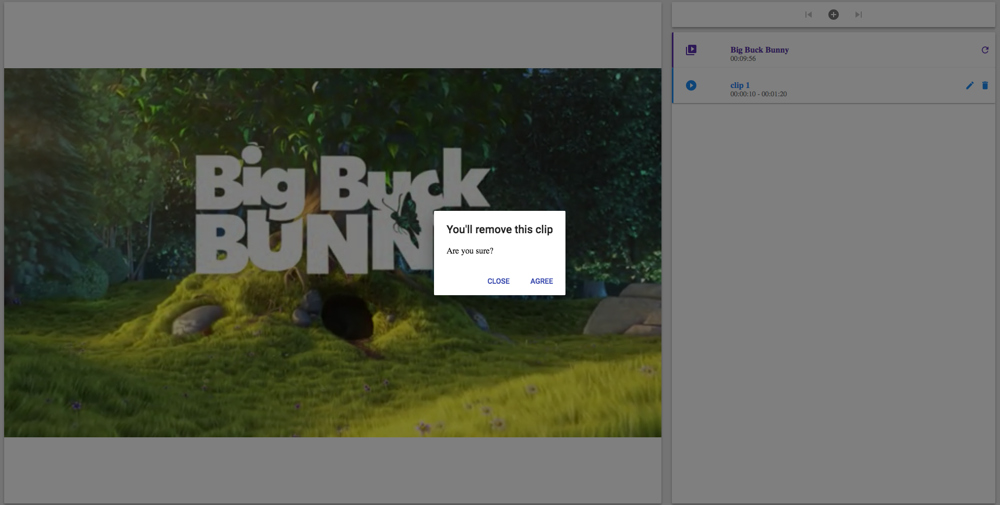
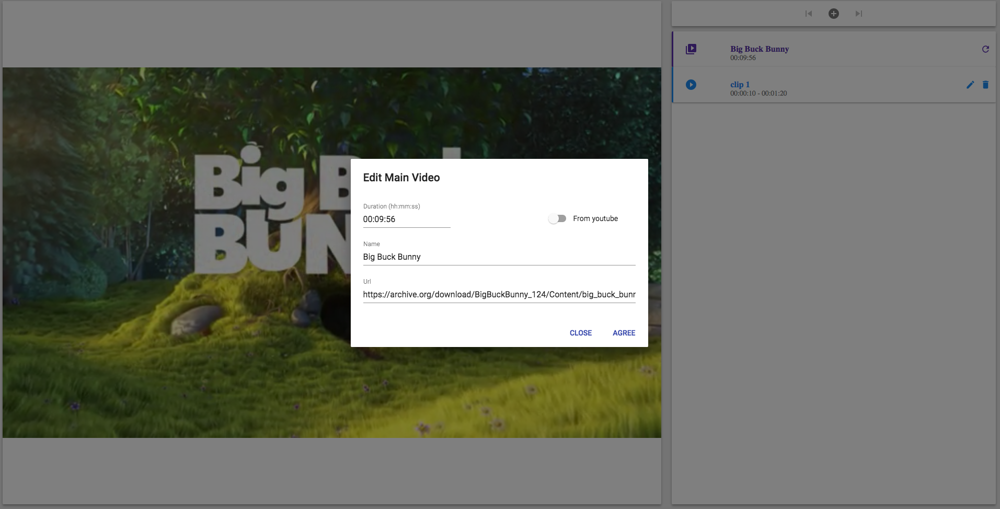

# Video clipper
## challenge for jobsity

This app allow you load a video from youtube (using the id) or adding a url where is video uploaded. Next images will show you some instructions to use this app.

