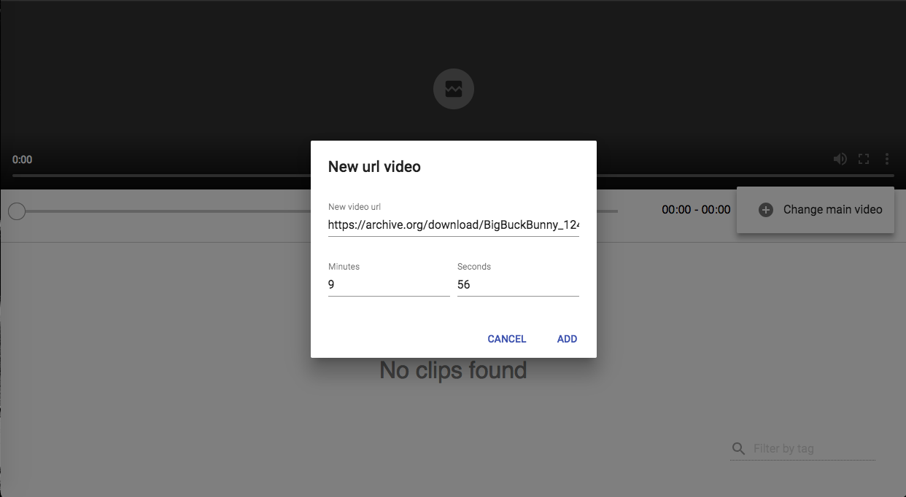
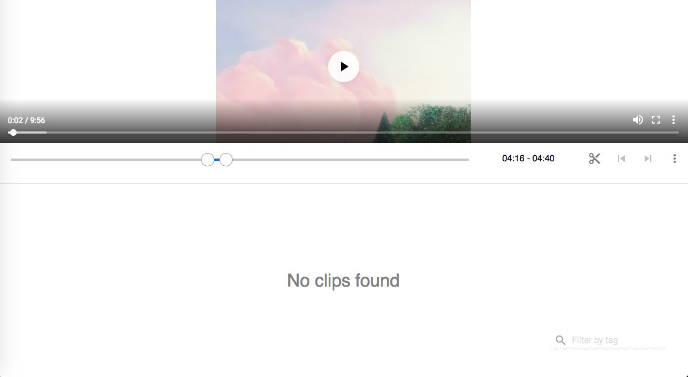
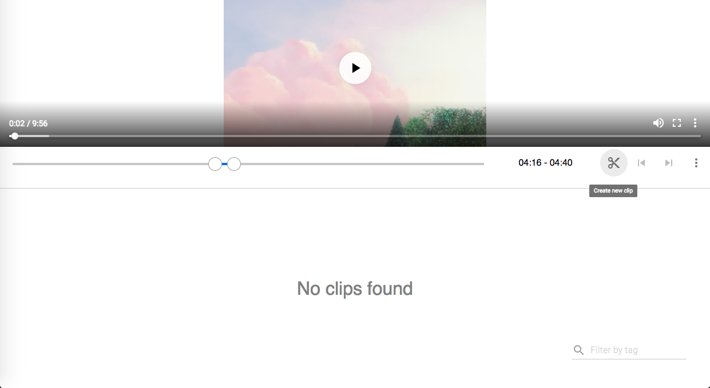
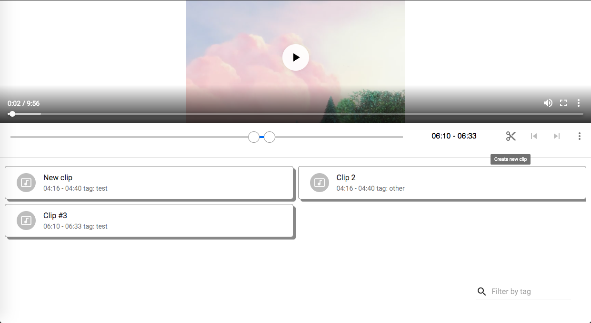
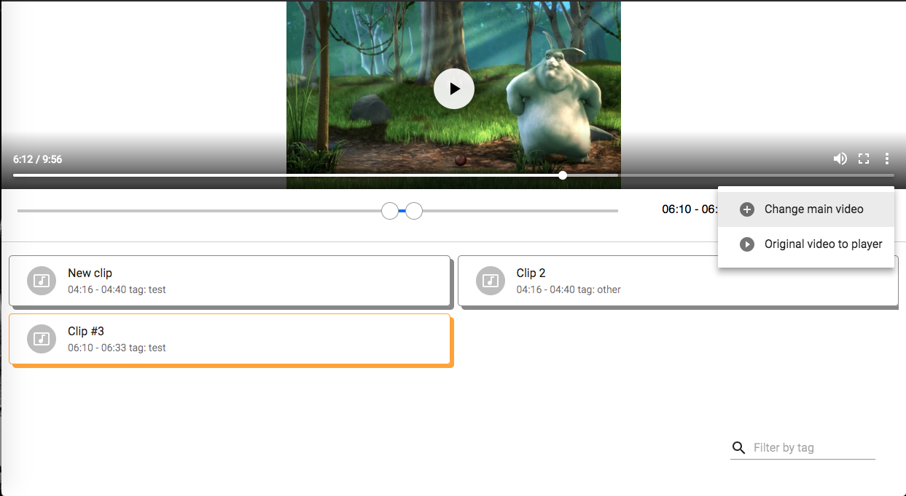

# Video clipper
## challenge for jobsity

This app allow you load a video from youtube (using the id) or adding a url where is video uploaded. Next images will show you some instructions to use this app.

To save data of this app (I don't use any permanent storage like LocalStorage). I'm using [React Api Context](https://reactjs.org/docs/context.html) to save data (clips and main video). For styles I used [material-ui](https://material-ui.com/). Also I used [create-react-app](https://github.com/facebook/create-react-app) to create basic template for this app.

To run the app you must install dependencies and start it:

1. `npm install` or `yarn install`
2. `npm start` or `yarn start`

You can set the main video with click on plus button. In this modal you must add url and time for the video.

By default you can play the original video with click on play button embed on video.

You can choose the range to create athe new clip.

After modify range you can create the new clip only clicking the scissors button. And on the modal opened you must add the clip's name and its tag.

After click on scissors button you can watch the clips list and clink on any one to play the clip.

When you click on a clip it will change its style to indicate active state. Also you can use previous and next buttons to navigate between clips. You can navigate the clips using leftArrow and rightArrow keys.

If you want to play full video you can clicl play button on controls component.

If you want to filter by tag you can do it writing on TextField located at right lower border.

